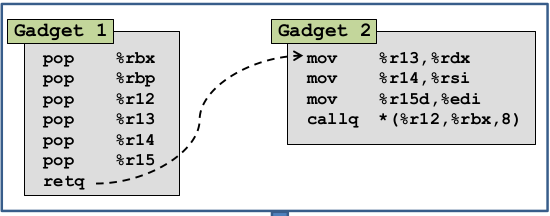
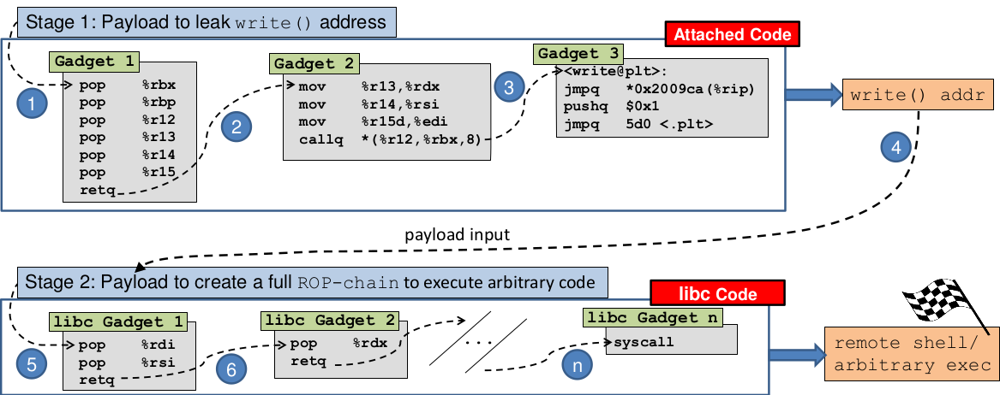
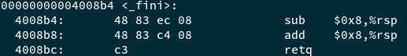
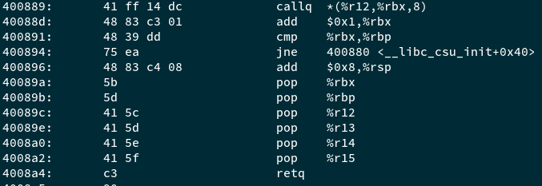

# ret2csu

## 0x01 题目

​	题目只提供了64位的程序，而且也说明了题目的答案是构造payload来调用ret2win函数即可。限制点在于要设定ret2win函数的第三个参数的值是`0xdeadcafebabebeef`，在64位下即修改`rdx`寄存器的值即可。

## 0x02 分析

​	用gdb看了下，溢出点与前几道题目一致，且题目中本身提供了ret2win函数，只需要找到`pop rdx`或者`mov rdx, xxx`之类的gadgets即可。然而仔细查看了有效的gadgets之后并没有找到类似的gadgets。仔细看了题目的提示后，学习了题目中给的文档，知道了一种新的rop技术，分别有几种叫法：`"Universal ROP", "μROP", "return-to-csu" 或者 "ret2csu"`。

​	它利用了`__libc_csu_init()`函数中的gadget来构造一个通用的gadgets链，如下所示：

可以用来控制执行如下函数：

> addr = r12 + rbx*8
>
> funcPtr = addr
>
> arg1 = edi (只有低32位)
>
> arg2 = rsi
>
> arg3 = rax

由于`r12+rbx*8`是一个地址指针，因此要查找一个有效的地址指针，使其指向我们的目标函数即可。通常完整的gadget链构造会采用如下方法构造：

也就是说先考虑泄露libc的地址，然后利用libc的gadget来执行任意代码，即ret2libc的方式。

​	但是这种利用方式并非题目中所要求的方式，因此还需要考虑其他方法。搜索了下ret2csu关键词后，发现在pwntools工具的[3d03a75](https://github.com/Gallopsled/pwntools/commit/3d03a7597566101a06f4e3a7cb3caa1e7e686a05)版本提交了一个ret2csu的函数，用来自动生成ret2csu的payload，仔细研究了其代码后发现它用了一种比较巧妙的方法，调用`_fini`函数来返回到`__libc_csu_init()`中，也就是`call *(%r12, %rbx, 8)`的下一条指令，需确保`rbx+1=rbp`,然后平衡栈后ret。

对应到本题中就可以用这种方法，具体的利用代码参考ret2csu.py。